<div align="center">



<p>
  <a href="https://zakisserious.github.io">
    
  </a>
  <a href="https://www.linkedin.com/in/zakaria-omar-21b0b729b/">
    
  </a>
  <a href="mailto:zakaria.m.omar@gmail.com">
    
  </a>
</p>


</div>

---

<details open>

<summary><h2 style="display:inline-block"><code>~/toolbox</code> — My Toolbox</h2></summary>

**Languages**

<p>

</p>

**Frontend**

<p>

</p>

**Backend**

<p>

</p>

**Databases**

<p>

</p>

**AI**

<p>

</p>

**Also:** LangChain, Ollama, ChromaDB, Local LLMs, RAG, ReAct Agents

**Cloud & DevOps**

<p>

</p>

</details>

---

<details>

<summary><h2 style="display:inline-block"><code>~/focus</code> — What I'm Building</h2></summary>

**codebase-qa** — chat with any GitHub repository using natural language.

A fully local AI assistant powered by RAG and ReAct agents. Ask anything about a codebase and get answers that point to the actual files.

| Capability | What it does |
| :--------- | :----------- |
| AST-aware indexing | Understands code structure, not just text |
| Ollama support | Runs entirely on local LLMs |
| Semantic retrieval | Finds the most relevant code fast |
| Fully local | Nothing ever leaves your machine |

</details>

---

<details>

<summary><h2 style="display:inline-block"><code>~/projects</code> — Featured Projects</h2></summary>

| Project | What it does |
| :------ | :----------- |
| [codebase-qa](https://github.com/zakisserious/codebase-qa) <br>  | Local AI assistant to chat with any GitHub repo (RAG + ReAct agents) |
| [pathfinder](https://github.com/zakisserious/pathfinder) <br>  | Interactive pathfinding visualizer with 9 algorithms |
| [Artists-Evolution-Data](https://github.com/zakisserious/Artists-Evolution-Data) <br>  | Trace an artist's breakout era through interactive data viz |

</details>

---

<details>

<summary><h2 style="display:inline-block"><code>~/achievements</code> — Some Things I'm Proud Of</h2></summary>

Quick wins from the terminal log:

```text
$ git log --oneline --achievements

✓ mentor     200+ students in programming fundamentals
✓ built      codebase-qa — local AI developer tool (RAG + ReAct)
✓ shipped    blockchain certificate verification system
✓ deployed   pathfinder visualizer (9 algorithms)
```

</details>

---

<details>

<summary><h2 style="display:inline-block"><code>~/roadmap</code> — Currently Learning</h2></summary>

Always learning — here's what's on the plate:

| Topic | Progress | Why |
| :---- | :------- | :--- |
| AI Agents | ▓▓▓▓░░░░░░ | autonomous, tool-using systems |
| Rust | ▓▓░░░░░░░░ | fast, safe systems programming |
| Distributed Systems | ▓▓▓░░░░░░░ | software that scales |
| Code Intelligence | ▓▓▓▓░░░░░░ | understanding code programmatically |
| Compiler Tooling | ▓▓░░░░░░░░ | the machinery behind languages |

**Philosophy**

> Software should feel effortless. Fast. Beautiful. Useful.

</details>

---

<details>

<summary><h2 style="display:inline-block"><code>~/contact</code> — Let's Connect</h2></summary>

<div align="center">

<a href="https://zakisserious.github.io">

</a>

<a href="mailto:zakaria.m.omar@gmail.com">

</a>

<a href="https://www.linkedin.com/in/zakaria-omar-21b0b729b/">

</a>

</div>

</details>

---

<div align="center">

<sub>*SYSTEM: ONLINE · always shipping_*</sub>

</div>
